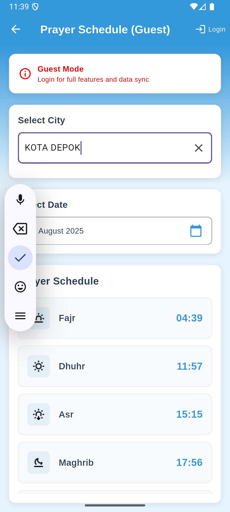

# DeenUp App

DeenUp is a mobile application designed to help users with prayer schedules and times based on their location. The app offers user registration and login functionalities, providing a personalized experience.

## Features

- **User Registration and Login**: Secure user authentication to access personalized features.
- **Prayer Schedules**: Get accurate prayer times based on your location.
- **Profile Management**: Update user information and view profile details.
- **Multi-Language Support**: The app is available in English and other languages.
- **Responsive Design**: User-friendly interface for both Android and iOS devices.

## API Usage

The application utilizes two main APIs to fetch location data and prayer schedules:

1. **Get Location API**
   - **Endpoint**: `https://api.myquran.com/v2/sholat/kota/semua`
   - **Description**: Retrieves a list of all available cities to provide location-specific prayer times.

2. **Prayer Schedule API**
   - **Endpoint**: `https://api.myquran.com/v2/sholat/jadwal/:kota/:date`
   - **Description**: Fetches the prayer schedule for a specific city on a given date, ensuring users have the most accurate prayer times.

## Technology Stack

- **Flutter**: For building the cross-platform mobile application.
- **Dart**: The programming language used with Flutter.
- **Firebase**: For user authentication and storage (if applicable).

## Screenshots

### Welcome Screen


### Registration and Login


### Main Features



## Getting Started

To install and run the app, you need:

1. **Flutter SDK**: [Installation instructions](https://flutter.dev/docs/get-started/install).
2. **Android Studio** or another IDE: To build and test the application.

### Installation

Clone the repository:

```bash
git clone <repository-url>
```

## useful commands
```bash
flutter clean
flutter pub get
flutter devices
flutter run -d <emulator_id>
flutter run -d emulator-5554 #example with emulator id
flutter build apk
```
## nvm commands
```bash
nvm install 22
nvm use 22
```